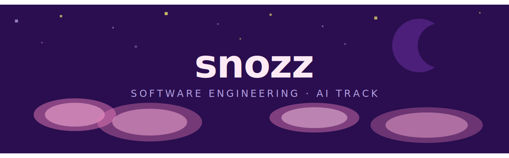

Software Engineering student at DuocUC, Santiago — AI track, third year.

I work across the full stack: backends, mobile, databases.

Currently learning applied AI (RAG, LangChain, agents)

playing with my homeserver and esp32.

---

